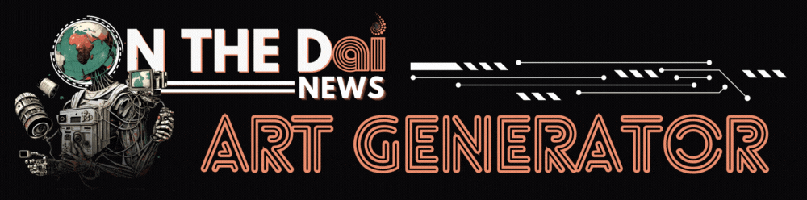
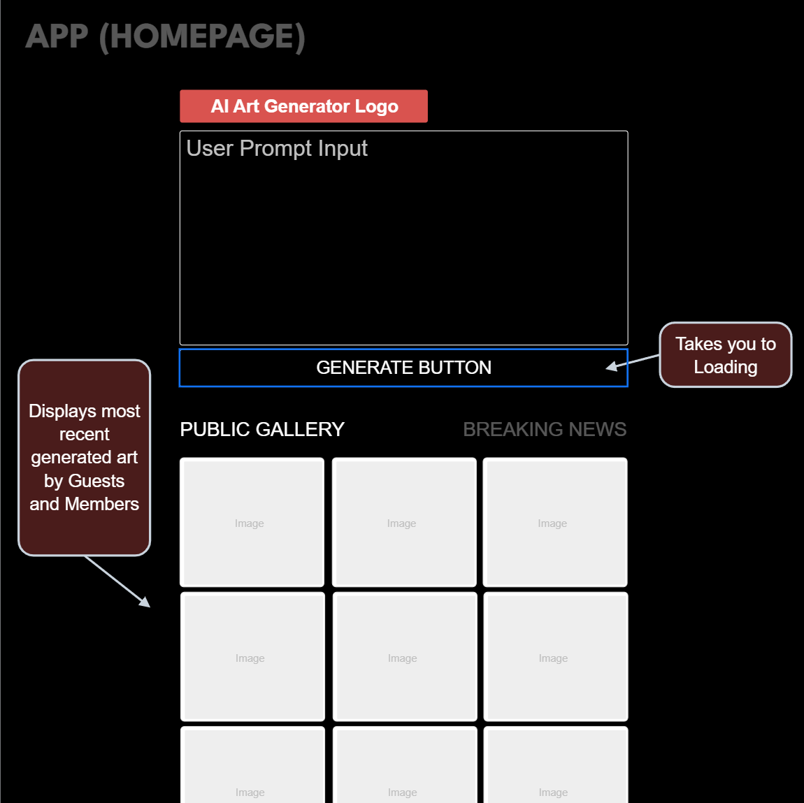
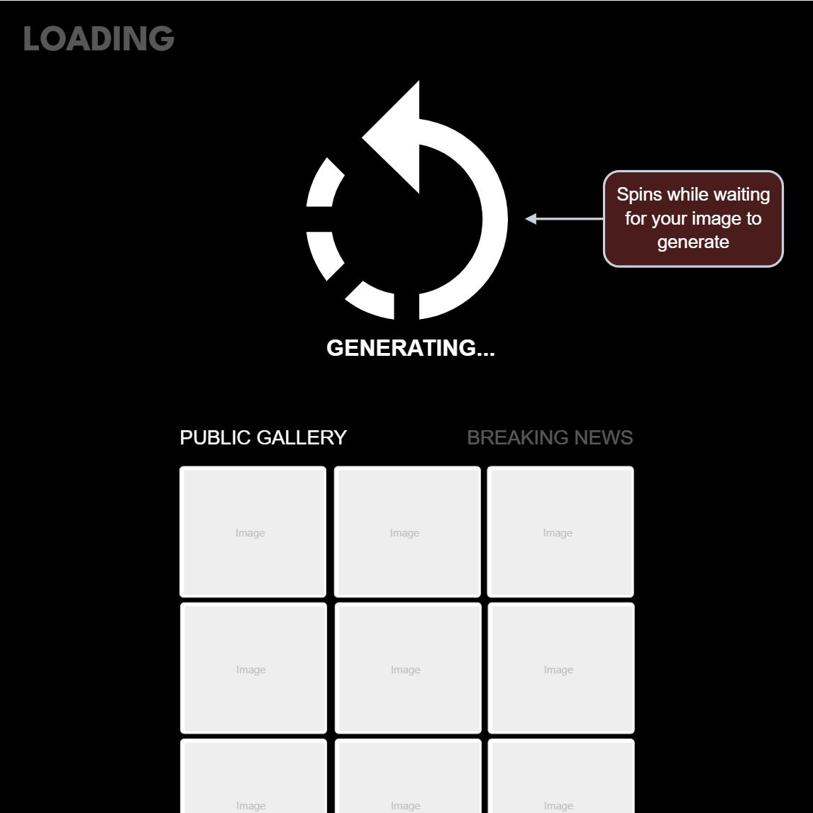
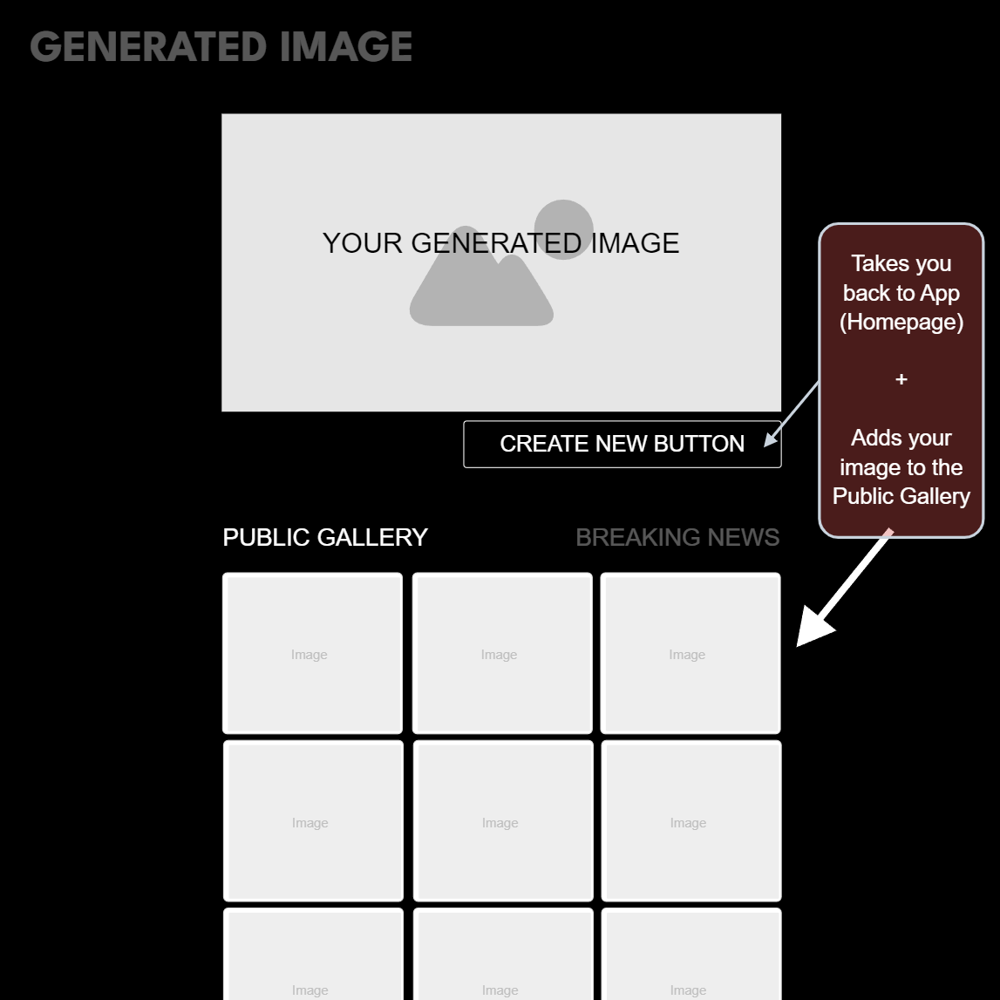
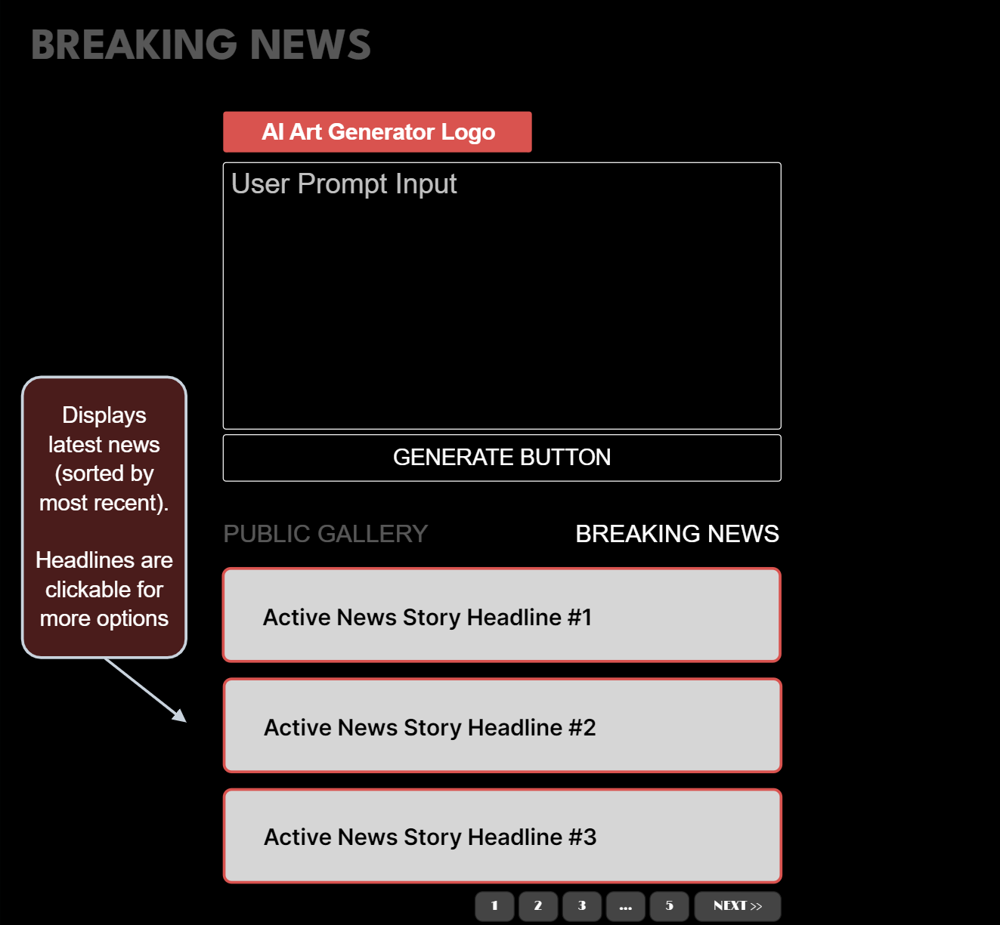
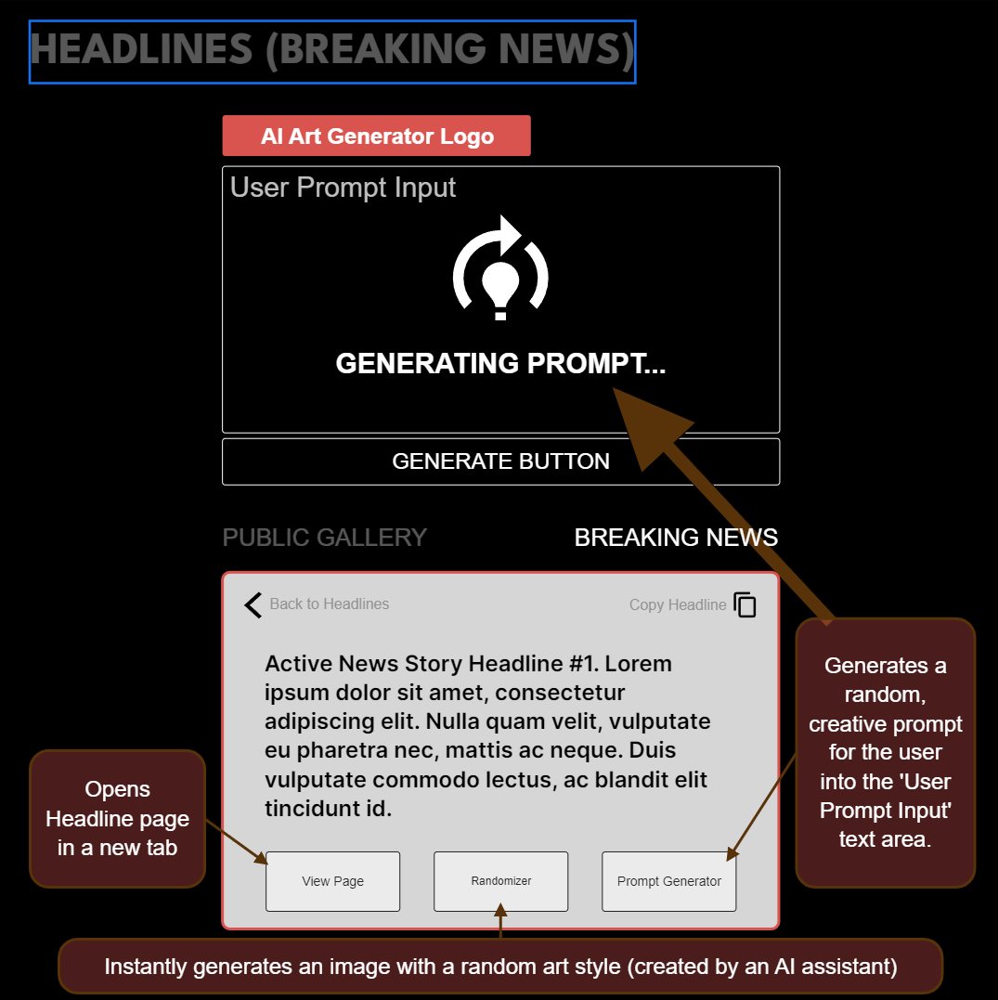

## Overview

The OTDNews AI Art Generator is a feature of the ON THE Dai News website that combines breaking world news with community-generated AI art. Users, both guests and members, can create art either manually with their own prompts or with the assistance of AI. Members have the option to submit their generated art pieces as representations of currently active breaking news stories, with the chance for their artwork to become the official piece for that story.

### Problem

The OTDNews AI Art Generator addresses the need for innovative and engaging ways to consume and interact with breaking news stories. Traditional news often lacks a creative outlet for users to express their interpretations and emotions surrounding current events. By combining news updates with AI-generated art, the app provides a unique platform for users to visually express their reactions and perspectives on the news, fostering community engagement and creative expression in the process. By offering the opportunity for users' artwork to be featured as the official representation of a news story, the app incentivizes participation and rewards creativity within the community.

### User Profile

The app caters to both guests and members who sign-up. In this version(2.0), anyone can utilize the app to create AI-generated art based on breaking news stories, providing them with a creative outlet to express their interpretations visually. Logged-in members (will potentially) have access to a personal photo gallery for their own creations, enhancing their user experience and fostering a sense of ownership over their art. Special considerations include ensuring a seamless and intuitive user interface for both guests and members, maintaining privacy and security measures for member accounts and galleries, and integrating APIs from Leonardo AI and OpenAI's ChatGPT to provide users with high-quality art style prompts and assistive features. The app must be responsive and accessible across various devices and screen sizes as the users that visit my site are divided between mobile and desktop.

### Features
- Generator
    - User Input
- Dynamic Section
    - Public Gallery
    - Breaking News Stories
    - My Art Gallery (nice to have feature for members)

Generator
- User Input
  - Textarea
  - Generate Button
  - Loading Screen
  - Generated Image
  - Create New Button
  - Share Image Button
  - Submit Art Button (leads to Breaking News Stories)
  - Submission Form + Button

Dynamic Section
- Public Art Gallery
- Breaking News Stories
    - Clickable headline
    - Expands to show full news story and  options: back button, generate art, prompt randomizer
- My Art Gallery (Nice to have feature for members)
    -Member's art creations

## Implementation

### Tech Stack

Frontend:
HTML, Sass, JavaScript (React.js), React Router (maybe), Axios

Backend:
Nodemon (maybe), Express.js(maybe)

### APIs

Leonardo AI API (for generating AI art)
Wordpress API (for populating breaking news stories)
OpenAI ChatGPT API (for AI-assisted prompts)

### Sitemap

Home/Generator Page:
This is one page where users can input prompts to generate AI art, plus components that will allow them to view a public photo gallery, active breaking news stories, log-in/register, and submit/share their art.

### Mockups

### Data

Data will be stored remotely in Leonardo AI and OpenAI's database for now. May create my own database for Member's personal art generations.

### Endpoints

*Leonardo AI Endpoints
GET - https://cloud.leonardo.ai/api/rest/v1/generations

GET - https://cloud.leonardo.ai/api/rest/v1/generations/user/5fc49543-399b-4eb1-ab31-ca611e89df0e?offset=0&limit=30

POST - const options = {
                method: 'POST',
                headers: {
                    accept: 'application/json',
                    'content-type': 'application/json',
                    authorization: `Bearer ${apiKey}`
                },
                body: JSON.stringify(requestData)
            };

*OpenAI endpoints
POST- https://api.openai.com/v1/threads/{thread_id}/messages

Return - {
  "id": "msg_abc123",
  "object": "thread.message",
  "created_at": 1698983503,
  "thread_id": "thread_abc123",
  "role": "assistant",
  "content": [
    {
      "type": "text",
      "text": {
        "value": "Hi! How can I help you today?",
        "annotations": []
      }
    }
  ],
  "file_ids": [],
  "assistant_id": "asst_abc123",
  "run_id": "run_abc123",
  "metadata": {}
}

### Auth

There will be OAuth for Google and Discord, (and potentially for Twitter, TikTok, Facebook, and other platforms). Users will have the option to log in using their Google or Discord accounts, which will authenticate them securely. There will be a registration page where users can create an account within WordPress. Users will be provided with access to their profiles and personalized features within the website and app.

## Roadmap

Sprint 1: Week 1
- Set up project repository
- Implement basic frontend layout
- Implement Generator page with user input and generate functionality
- Integrate Leonardo AI API
- Develop Public Photo Gallery page for showcasing user-generated artwork

- Set up Breaking News Stories page with dynamic display of news stories
- Develop functionality for viewing full news stories and options

Sprint 2: Week 2
- Implement submission form page for users to submit generated art
- Integrate OpenAI ChatGPT API for AI-assisted prompts
- Conduct testing and debugging for frontend and backend functionality
- Perform comprehensive testing and debugging of the entire application
- Implement user registration functionality within WordPress
- Integrate OAuth for Google and Discord authentication
- Implement any necessary security enhancements and validation checks
- Finalize documentation and prepare for project submission

## Nice-to-haves

- Set up database schema for storing user art generations
- Implement additional OAuth integrations for Twitter, TikTok, Facebook, etc.
- Enhance user profile functionality with options to customize profiles and view activity history
- Implement features for liking, commenting, and sharing artworks within the Public Photo Gallery
- Develop advanced filtering and sorting options for artworks in the Public Photo Gallery
- Enhance submission form with validation checks and additional submission options
- Explore options for implementing real-time collaboration features for generating AI art with friends or other users